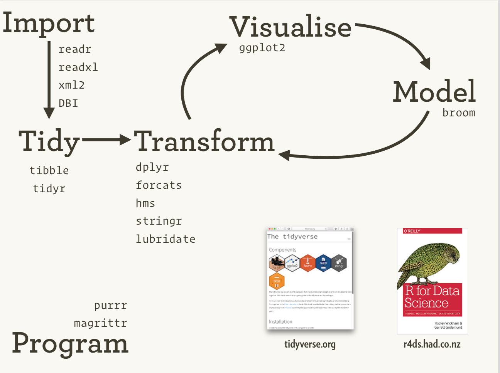
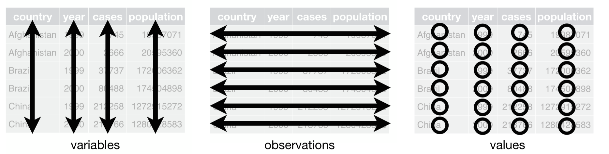
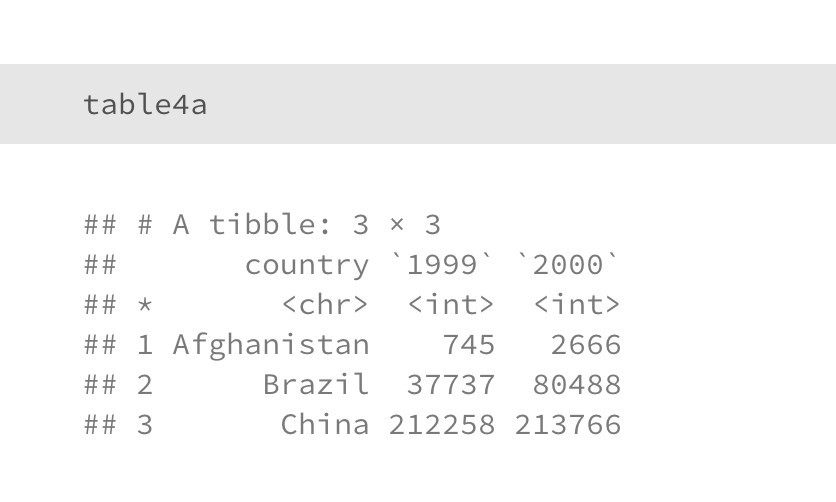
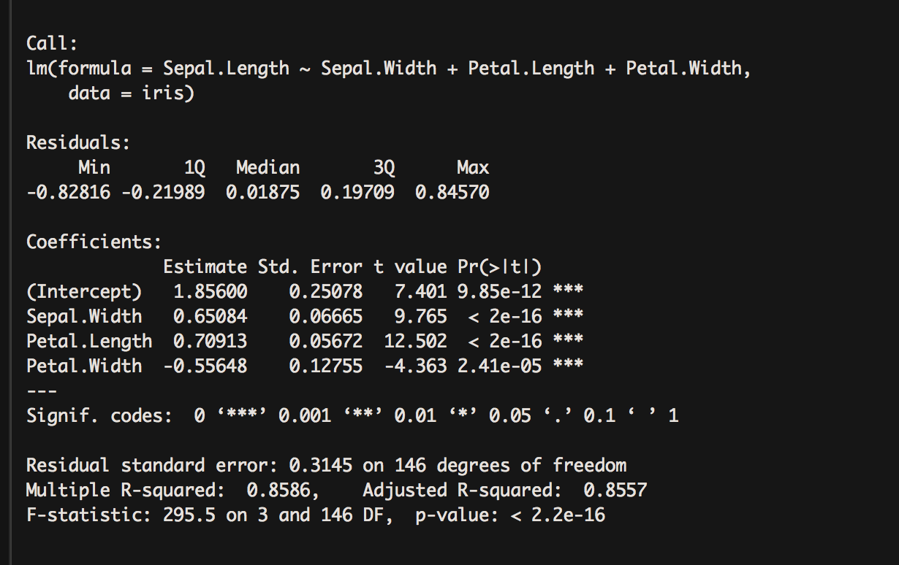
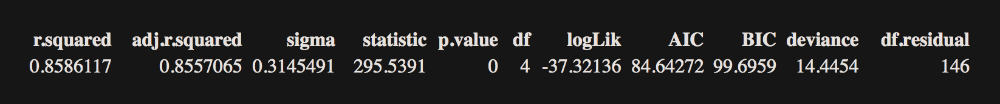
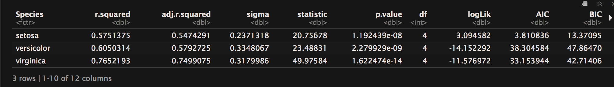
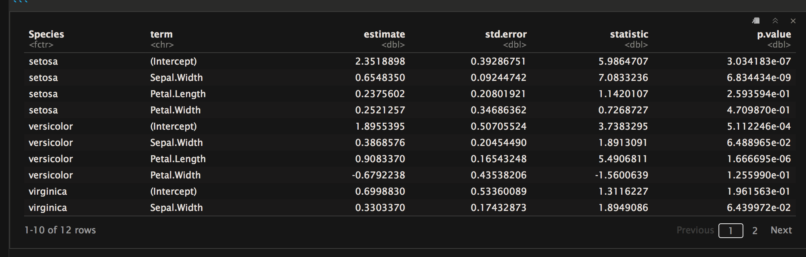

```{r setup, include=FALSE}
knitr::opts_chunk$set(echo = TRUE)
#knitr::opts_chunk$set(fig.width=5, fig.height=2.5) 

library(knitr)
library(tidyverse)
library(broom)
iris

mtcars2 <- mtcars 

mtcars2$cars <- row.names(mtcars)

mtcars2 <- mtcars2 %>% select(-vs,-am,-gear,-carb)

mtcarsNew <- mtcars2 %>% gather(attribute, value, mpg:qsec)


```


## R and the tidyverse

1. What is R?
  + R is an open source programming language and software environment for statistical computing
  + It consists of base R syntax and an ecosystem of R packages for advanced computation
  + Most R packages are created and maintained by volunteers

2. What is the Tidyverse?
  + The tidyverse is an ecosystem of packages within R meant to simplify data analysis and visualization
  + Originally conceived of and developed by Hadley Wickham but has grown into a thriving community of developers
  
  

## The relationship between different components of the tidyverse

{height=75%, width=75%}


## Plan for today's lecture
In today's lecture we assume that data has been loaded on tools for analyzing data, namely:

1. dplyr: used to manipulate data 
2. magrittr: piping operation that makes data transformation/manipulation more readable
3. tidyr: used to make tidy data (method of storing data for future analysis) 
4. ggplot2: used to develop visualizations
5. broom: used to convert statistical models into tidy data

Download laboratory and exercise files from this github repo:

https://github.com/cmlakhan/dplyr_tutorial/archive/master.zip


## Laboratory and Exercise
In order to give you hands-on experience with dplyr we have created an in-class laboratory and small exercise.  These files are R markdown files where you will fill in the requisite R code and then "knit" the markdown to create an html file.  You will need to do the following:

*  Open the laboratory file "1_bmi_704_laboratory.Rmd" and fill in the R code.  Once that is done knit the file to generate an html file.
*  Open the exercise file "1_bmi_704_exercise.Rmd" and write your own R code to complete the assignment.  Once that is done knit the file and generate an html file.
* Submit both html files to the Dropbox below:

https://www.dropbox.com/request/uUktvEpV6B79jT2hiZWJ

* Due date will be Friday, 2/2/2018 by 11:59 pm


## Dataset that will be used in this tutorial
We will use the **iris** dataset as a running example throughout this lecture


```{r}


kable(iris %>% sample_n(6), row.names = FALSE)


```


## The verbs of dplyr

dplyr is used to manipulate and manage data, it abstracts most common data manipulation tasks into verbs (6 most common below):

1. filter: filters out rows according to some conditions

2. arrange: reorders rows according to some conditions

3. select: selects a subset of columns

4. mutate: adds a new column as a function of existing columns

5. summarize: collapses a data frame to a single row

6. group_by: breaks a data frame into groups of rows

See [Data Transformation Cheatsheet](https://github.com/rstudio/cheatsheets/raw/master/data-transformation.pdf) for more data manipulation verbs


## The concept of piping of data

* We can compose dplyr verbs together using a piping construct (inspired by functional programming) to create very complicated data manipulation tasks.  

* **Pipes** use the pipe operator where output from one function/operation will be input into the next

## Magrittr (%>%)

Piping is denoted by the symbol %>%.  One can chain various verbs together using %>%

x %>% f(y) means that x is 'piped' into the function f(x,y)

```{r}

head(iris, n=2)


iris %>% head( n=2)

```

## Example: Using filter
```{r, eval=FALSE}
###### Picking rows with filter() #######

### Base R equivalent
iris[iris$Species == "virginica",]

### using dplyr::filter()
filter(iris, Species == "virginica") 


# Equivalent code with %>% pipe
iris %>% filter(Species == "virginica")


```
```{r, echo=FALSE}

kable(iris %>% filter(Species == "virginica") %>% sample_n(4), row.names = FALSE)


```

## Example: Using filter with two conditions
```{r, eval=FALSE}
iris %>% 
  filter(Species == "virginica", Sepal.Length > 7.5)


```
```{r, echo=FALSE}

kable(iris %>% filter(Species == "virginica", Sepal.Length > 7.5), row.names = FALSE)

```


## Example: Using select
```{r, eval=FALSE}
iris %>% select(Species, Petal.Length)


```
```{r, echo=FALSE}

kable(iris %>% select(Species, Petal.Length), row.names = FALSE)

```


## Example: Using unselect
```{r, eval=FALSE}
iris %>% select(-Species)


```
```{r, echo=FALSE}

kable(iris %>% select(-Species), row.names = FALSE)

```


## Example: Combining filter and select

```{r, eval=FALSE}
iris %>% 
	filter(Species == "virginica", Sepal.Width > 3.5) %>% 
	select(Petal.Width)


```


```{r, echo=FALSE}

kable(iris %>% 
	filter(Species == "virginica", Sepal.Width > 3.5) %>% 
	select(Petal.Width), row.names = FALSE)

```


## Example: Using mutate
```{r, eval=FALSE}
iris %>% 
  mutate(Sepal.Area = Sepal.Width * Sepal.Length) %>% 
  select(-Sepal.Length, -Sepal.Width)


```


```{r, echo=FALSE}

kable(iris %>% mutate(Sepal.Area = Sepal.Width * Sepal.Length) %>% select(-Sepal.Length, -Sepal.Width), row.names = FALSE,padding = 0)

```


## Arrange
```{r, eval=FALSE}
iris %>% 
	mutate(Sepal.Area = Sepal.Width * Sepal.Length) %>% 
	filter(Sepal.Area < 15) %>% 
	arrange(Sepal.Area) %>%
  select(-Sepal.Length, -Sepal.Width)


```


```{r, echo=FALSE}

kable(iris %>% 
	mutate(Sepal.Area = Sepal.Width * Sepal.Length) %>% 
	filter(Sepal.Area < 15) %>% 
	arrange(Sepal.Area) %>%
  select(-Sepal.Length, -Sepal.Width)
, row.names = FALSE,padding = 0)

```


## Example: Using summarise
```{r, eval=FALSE}
iris %>% 
	mutate(Sepal.Area = Sepal.Width * Sepal.Length) %>% 
	filter(Sepal.Area < 15) %>% 
	summarise(count=n(), mean=mean(Sepal.Area))


```


```{r, echo=FALSE}

kable(iris %>% 
	mutate(Sepal.Area = Sepal.Width * Sepal.Length) %>% 
	filter(Sepal.Area < 15) %>% 
	summarise(count=n(), mean=mean(Sepal.Area)), row.names = FALSE,padding = 0)

```


## Example: Using summarise and group_by
```{r, eval=FALSE}
iris %>% 
	mutate(Sepal.Area = Sepal.Width * Sepal.Length) %>% 
	filter(Sepal.Area < 15) %>% group_by(Species) %>% 
	summarise(count=n(), mean=mean(Sepal.Area))


```


```{r, echo=FALSE}

kable(iris %>% 
	mutate(Sepal.Area = Sepal.Width * Sepal.Length) %>% 
	filter(Sepal.Area < 15) %>% group_by(Species) %>% 
	summarise(count=n(), mean=mean(Sepal.Area)), row.names = FALSE,padding = 0)

```


## Grouped Dataframes
* Using the group_by operator will create a grouped data frame which acts as multiple data frames partitioned by groups used in the group_by condition.  
* All operations will not be done on the entire data frame but on each grouped subset
* You can use the ungroup() operations to remove the grouping variable


## The concept of tidy data


When working with data it is important to normalize data.  Concept introduced in the database community by E.F. Codd.  In the tidyverse a tidy dataset is defined as follows:

1. Each	variable forms	a	column.
2. Each	observation	forms	a	row.
3. Each	type of observational unit forms a table.




## Is this data tidy or not tidy?
Is Iris tidy or not tidy?

```{r, echo=FALSE}
kable(iris %>% sample_n(6), row.names = FALSE)
```

Yes, because each row are the measurements for 1 flower making it one observation.


## Is this data tidy or not tidy?

What about this data set?

Each row is a country and the columns '1999' and '2000' represents the counts of a disease during those years.




## Is this data tidy or not tidy?

* This is not tidy because the columns '1999' and '2000' represents measurements for different years.  

* Why do we care?  

    + Imagine we are the WHO and we are constantly updating this database it would be more difficult to add new columns to the new database rather than simply appending new data.
    


## tidyr can be used to massage into a tidy structure

There are two fundamental verbs of data tidying:

1. gather:  takes multiple columns, and gathers them into key-value pairs: it makes “wide” data longer.

    + gather(data, key, value, ..., na.rm = FALSE, convert = FALSE)
    + ... represents columns that are meant to be turned into key-value pairs.

2. spread: takes two columns (key & value) and spreads in to multiple columns, it makes “long” data wider.

    + spread(data, key, value, fill = NA, convert = FALSE, drop = TRUE)


## Example for using gather
We will take the iris data and turn all measurements into key value pairs.
```{r, eval=FALSE}
iris_long <- iris %>% 
  gather(measurement, value_iris,Sepal.Length:Petal.Width)


```
```{r, echo=FALSE}
iris_long <- iris %>% gather(measurement, value_iris,Sepal.Length:Petal.Width) 


kable(iris_long %>% sample_n(5), row.names = FALSE,padding = 0)

```


## Example for using spread


```{r, eval=FALSE}
mtcarsSpread <- mtcarsNew %>% spread(attribute, value)

```

```{r, echo=FALSE}
mtcarsSpread <- mtcarsNew %>% spread(attribute, value)


kable(mtcarsNew %>% sample_n(5), row.names = FALSE,padding = 0)


kable(mtcarsSpread %>% sample_n(5), row.names = FALSE,padding = 0)

```


## Philosophy behind ggplot2

* ggplot2 is a graphics package in R that works directly on data frames

* Developed by Hadley Wickham as an R package that uses a grammar of graphics (introduced by Leland Wilkinson).

* ggplot2 grammar
    + data: the data frame being plotted
    + geometrics: the geometric shape that will represent the data
    + aesthetics: aesthetics of the geometric object
        + Color,	size,	shape,	etc.

[ggplot2 cheat sheet](https://github.com/rstudio/cheatsheets/raw/master/data-visualization-2.1.pdf)


## Different types of plots

* Histogram - geom_histogram()
* Density Plot - geom_density()
* Bar chart - geom_bar()
* Violin plot - geom_violin()
* Box plot - geom_boxplot()
* Scatter plot - geom_scatter()


## Example: Basic Histogram
```{r, fig.width=4, fig.height=2.5, message=FALSE}
ggplot(iris,aes(x=Sepal.Length)) + 
  geom_histogram()

```


## Example: Basic Histogram with 10 bins instead of default of 30
```{r, fig.width=4, fig.height=2.5, message=FALSE}
ggplot(iris,aes(x=Sepal.Length)) + 
  geom_histogram(bins = 10)

```


## Example: Histogram with facet_wrap with Species and fill = Species

```{r,fig.width=4, fig.height=2.5, message=FALSE}
ggplot(iris,aes(x=Sepal.Length, 
                fill=Species)) + 
  geom_histogram() + facet_wrap(~Species)

```


## Example: Boxplot with color = Species

```{r,fig.width=4, fig.height=2.5, message=FALSE}
ggplot(iris,aes(x=Species, y=Petal.Width, 
                color=Species)) + 
  geom_boxplot() 
```


## Example: Boxplot with fill = Species

```{r,fig.width=4, fig.height=2.5, message=FALSE}
ggplot(iris,aes(x=Species, y=Petal.Width, 
                fill=Species)) + 
  geom_boxplot() 
```


## Example: Boxplot with fill = Species and color = Species

```{r,fig.width=4, fig.height=2.5, message=FALSE}
ggplot(iris,aes(x=Species, y=Petal.Width,
color=Species ,fill=Species)) + 
  geom_boxplot() 
```


## We can use iris_long to plot all 4 flower measurements together

```{r,fig.width=6, fig.height=2.5, message=FALSE}
ggplot(iris_long,aes(x=Species, y=value_iris,
    fill=Species)) + geom_boxplot() + 
  facet_wrap(~measurement, scales = 'free') 
```


## Example: Scatterplot with color = Species

```{r,fig.width=4, fig.height=2.5, message=FALSE}

ggplot(iris,aes(x=Sepal.Length, y=Petal.Width, 
                color=Species)) +
  geom_point() 

```


## Example: Scatterplot with color = Species and shape = Species

```{r,fig.width=4, fig.height=2.5, message=FALSE}

ggplot(iris,aes(x=Sepal.Length, y=Petal.Width, 
                color=Species, shape=Species)) +
  geom_point() 

```


## Linear Modeling in Base R

One of the more interesting aspects of the tidyverse is that these methods can also be applied to linear modeling.  In a typical linear regression you get a fit object which conflate many things.


Most models produce output at three levels:

1.  Model level: $R^2$, residual standard error, MSE
2.  Term level: coefficient estimates, p-values, per-cluster information
3.  Observation level: predictions, residuals, cluster assignments


## Linear Modeling in Base R
```{r}
fit <- lm(Sepal.Length ~ Sepal.Width + 
            Petal.Length + Petal.Width, data = iris)
#summary(fit)
```

{ height=85%, width=85% }


## Philosophy behind broom

broom provides functions to tidy model output in each of these three ways.

1. glance(): construct a concise one-row summary of the model. This typically contains values such as R2, adjusted R2, and residual standard error that are computed once for the entire model.
2. tidy():  constructs a data frame that summarizes the model's statistical findings. This includes coefficients and p-values for each term in a regression, per-cluster information in clustering applications, or per-test information for multtest functions.
3. augment(): add columns to the original data that was modeled. This includes predictions, residuals, and cluster assignments.


## Glance function in broom
```{r, eval=FALSE}
kable(glance(fit))

```

{ height=90%, width=90% }


## Tidy function in broom
```{r, fig.width=3}
kable(tidy(fit))

```


## Running many regressions in parallel
We can use the broom + dplyr to run many regressions in parallel by using the group_by function.  We will need to use the do function from dplyr which allows you to do arbitrary computations within the dplyr framework.


```{r}
regressions <- iris %>% 
  group_by(Species) %>% 
  do(fit=lm(Sepal.Length ~ Sepal.Width + 
            Petal.Length + Petal.Width, data = .))

```


## Running many regressions in parallel
The regressions object now contains three fit objects, one for each Species

```{r}
regressions
```


## Extract model fits from each regression
```{r, eval=FALSE}
regressions %>% glance(fit)
```
{ height=90%, width=90% }


## Extract model coefficients from each regression

You can extract each model coefficient for each regression from one data frame.  This is a grouped data frame which you need to ungroup in order to do further analysis such as plotting.

```{r, eval=FALSE}
regressions %>% tidy(fit) %>% ungroup()
```
{ height=90%, width=90% }


## Acknowledgements

Borrowed heavily from presentations below:

http://john-ensley.com/slides/tidyverse/

http://sjspielman.org/bio5312_fall2017/slides/day2_intro_to_tidyverse.pdf


## Other Resources

* Data Science in the Tidyverse
    - https://www.rstudio.com/resources/videos/data-science-in-the-tidyverse/
    
* Tidyverse website
    - https://www.tidyverse.org/

* R tutorial for beginners
    - https://eringrand.github.io/RTutorials/
    
* R for Data Science Textbook
    - http://r4ds.had.co.nz/

